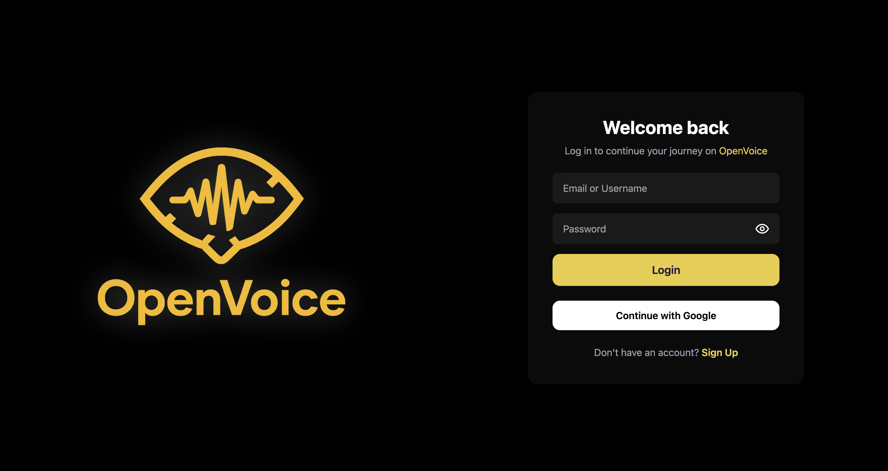
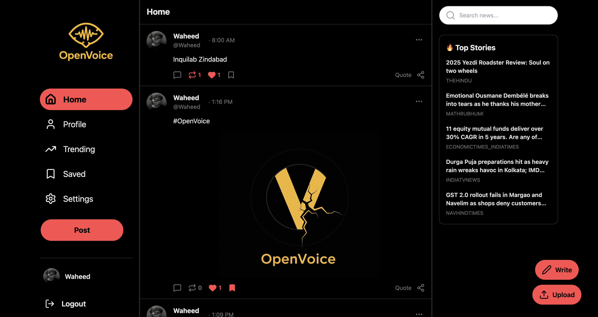
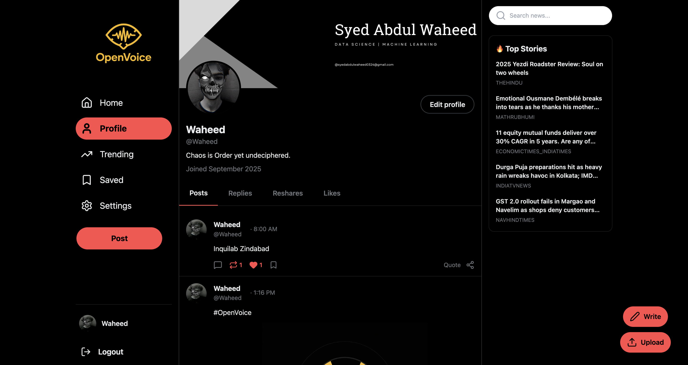
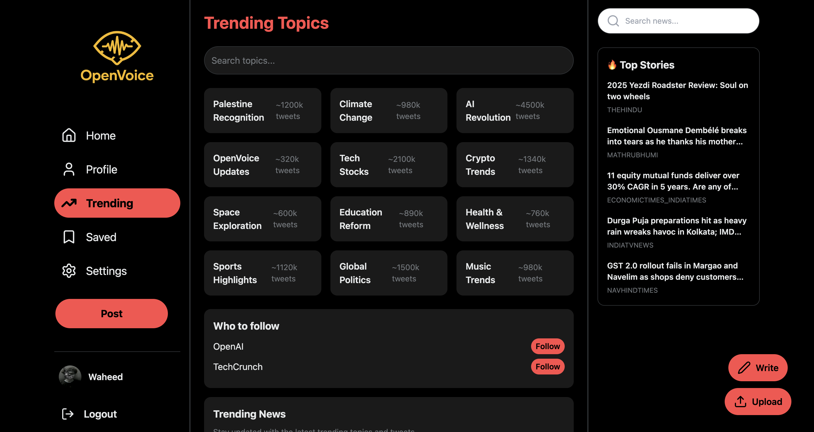
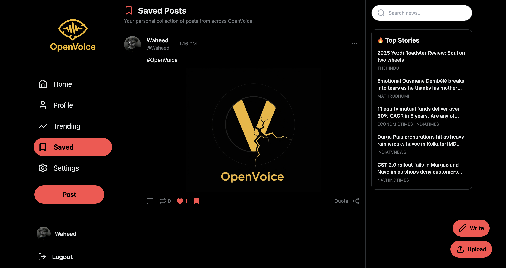
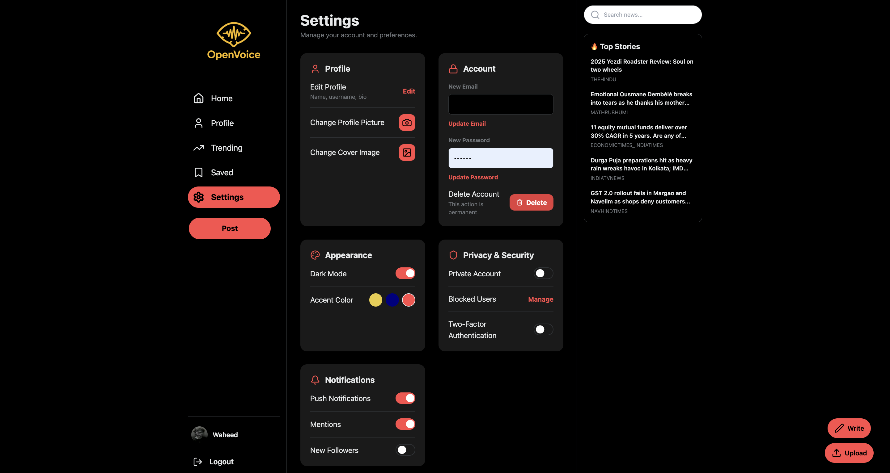
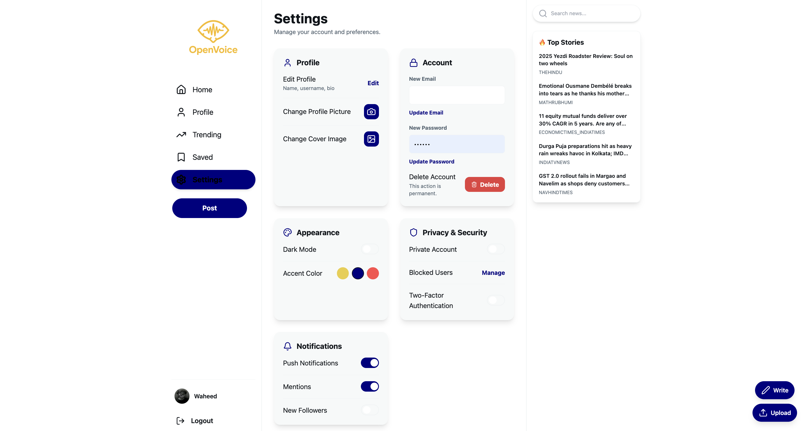
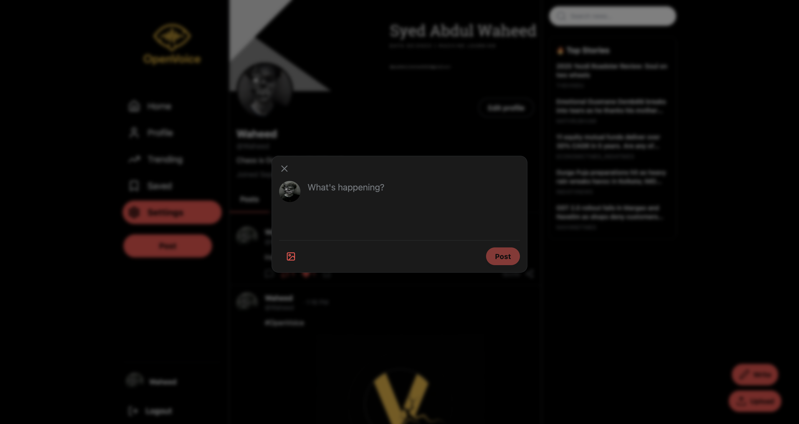

# OpenVoice 🗣️

OpenVoice is a Twitter-inspired social media platform that combines real-time user posts with live news trends. Stay updated, share your thoughts, and explore trending topics seamlessly.

---

## Features ✨

- **User Authentication:** Signup/Login using Supabase  
- **Post Creation:** Share posts with text and images  
- **Trending Feed:** Explore trending topics and live news integration  
- **Profile Management:** Edit profile, avatar, and preferences  
- **Dark & Light Mode:** Switch between themes  
- **Saved Posts:** Bookmark posts for later  

---

## Screenshots 📸

### Login Page


### Homepage / Feed


### Profile Page


### Trending Topics


### Saved Posts


### Settings / Preferences


### Light Mode


### Creating a Post


---

## Tech Stack 🛠️

- **Frontend:** React, TailwindCSS  
- **Backend:** Supabase (Authentication + Database)  
- **News API:** NewsData.io via Node.js proxy server  
- **Deployment:** Vercel / Netlify  

---

## Setup 🚀

1. Clone the repo:  
   ```bash
   git clone https://github.com/YOUR_USERNAME/openvoice.git
   cd openvoice
Install dependencies:
npm install

Add .env file(s) with your keys:
# Supabase
REACT_APP_SUPABASE_URL=YOUR_SUPABASE_URL
REACT_APP_SUPABASE_ANON_KEY=YOUR_SUPABASE_ANON_KEY
# News Proxy
NEWS_API_KEY=YOUR_NEWS_API_KEY
PORT=5050

Run the development server:

npm start ```
---

